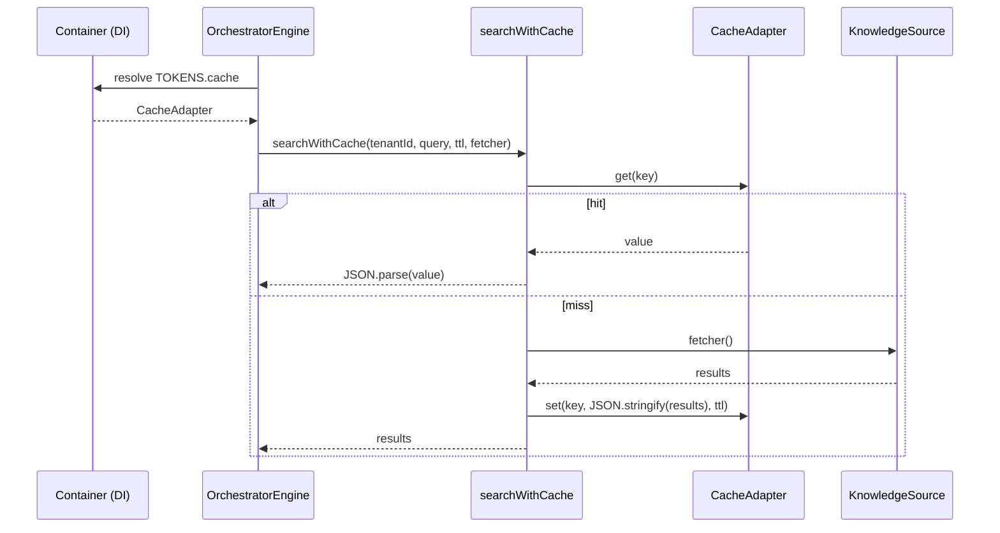

```mermaid
sequenceDiagram
  participant C as Container (DI)
  participant E as OrchestratorEngine
  participant S as searchWithCache
  participant CA as CacheAdapter
  participant K as KnowledgeSource

  E->>C: resolve TOKENS.cache
  C-->>E: CacheAdapter
  E->>S: searchWithCache(tenantId, query, ttl, fetcher)
  S->>CA: get(key)
  alt hit
    CA-->>S: value
    S-->>E: JSON.parse(value)
  else miss
    S->>K: fetcher()
    K-->>S: results
    S->>CA: set(key, JSON.stringify(results), ttl)
    S-->>E: results
  end
```
