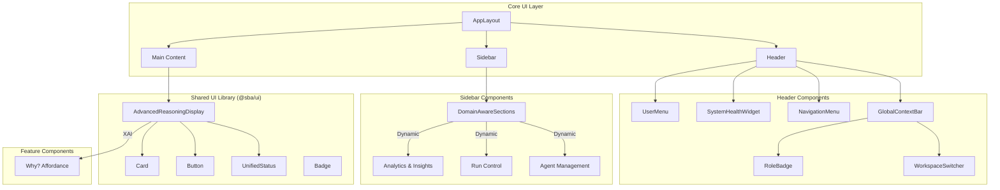

# Architecture Diagram - UI/UX Enhancements

```mermaid
graph TD
    subgraph "Core UI Layer"
        AL[AppLayout] --> H[Header]
        AL --> S[Sidebar]
        AL --> M[Main Content]
    end

    subgraph "Header Components"
        H --> GCB[GlobalContextBar]
        H --> NM[NavigationMenu]
        H --> SHW[SystemHealthWidget]
        H --> UM[UserMenu]

        GCB --> WS[WorkspaceSwitcher]
        GCB --> RB[RoleBadge]
    end

    subgraph "Sidebar Components"
        S --> DAS[DomainAwareSections]
        DAS -->|Dynamic| AgentNav[Agent Management]
        DAS -->|Dynamic| RunNav[Run Control]
        DAS -->|Dynamic| AnalyticsNav[Analytics & Insights]
    end

    subgraph "Shared UI Library (@sba/ui)"
        US[UnifiedStatus]
        B[Button]
        C[Card]
        Badge[Badge]

        AdvancedReasoning --> US
        AdvancedReasoning --> B
        AdvancedReasoning --> C
    end

    subgraph "Feature Components"
        M --> AdvancedReasoning[AdvancedReasoningDisplay]
        AdvancedReasoning -->|XAI| Explain[Why? Affordance]
    end
```
