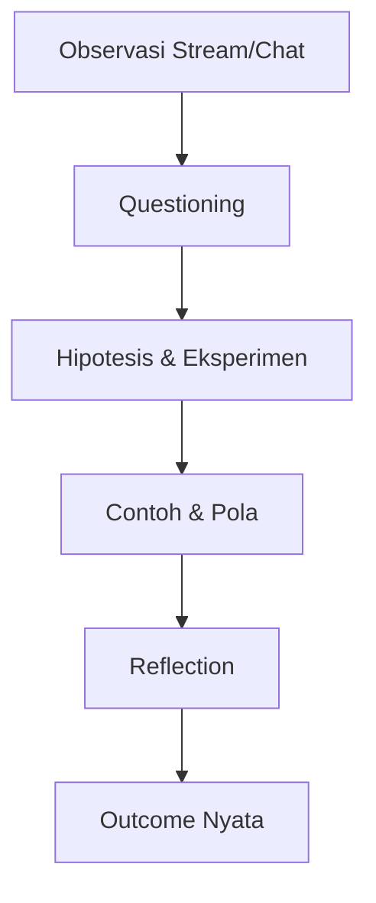

# Contextual Teaching and Learning (CTL) di SBA

Versi: 1.0.0
Riwayat Perubahan:

- 1.0.0 (2025-12-05): CTL diterapkan pada modul SBA.

## Komponen CTL

- Konstruktivisme: pengguna membangun pengetahuan lewat interaksi chat/dokumen/stream.
- Questioning: UI mendorong pertanyaan kritis pada hasil agen; hindari menerima mentah.
- Inquiry: proses pencarian penemuan sistematis dari observasi event → insight.
- Learning Community: kolaborasi tenant/role; berbagi percakapan/dokumen.
- Modeling: contoh alur run sukses dan pola respons ditunjukkan di UI.
- Reflection: ringkasan hasil/insight per sesi; catatan aksi.
- Authentic Assessment: validasi outcome yang nyata (mis. dokumen terupdate, keputusan bisnis).

## Penerapan per Modul

- apps/web: percakapan dan dokumen sebagai konteks dunia nyata; repos Supabase mendukung assessment.
- apps/app: stream agentic sebagai bahan inquiry; kontrol run untuk eksperimen.
- apps/api: memastikan proses inquiry valid (guard, schema, kontrak) dan terukur.

## Flow CTL

## Indikator

- Banyaknya pertanyaan kritis, hipotesis diuji, dan outcome kontekstual.
- Keterhubungan materi dengan situasi nyata (dokumen/percakapan/stream).
