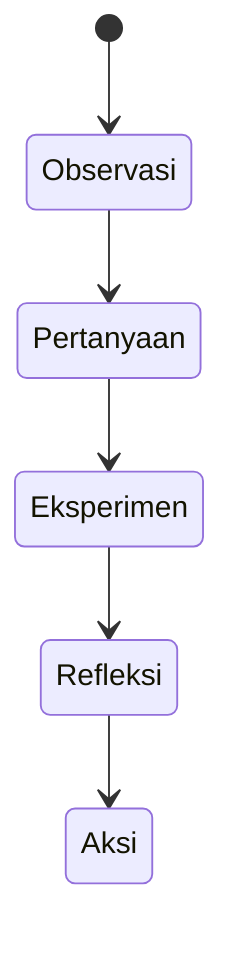

# Pembelajaran Mendalam (Deep Learning) di SBA

Versi: 1.0.0
Riwayat Perubahan:

- 1.0.0 (2025-12-05): Deep Learning sebagai filosofi belajar dalam SBA.

## Pilar

- Berkesadaran: tujuan jelas, alur eksplisit, fokus pada proses berpikir.
- Bermakna: koneksi ke konteks nyata (data, dokumen, stream, keputusan bisnis).
- Menggembirakan: pengalaman interaktif yang memicu rasa ingin tahu.

## Dimensi Keterampilan

- Penalaran kritis, kreativitas, kolaborasi, komunikasi, kemandirian.

## Implementasi

- Sequence inquiry: Observasi → Pertanyaan → Eksperimen → Refleksi → Aksi.
- Orkestrasi run sebagai sarana latihan berpikir sistematis.
- Catatan refleksi dan outcome ditautkan ke percakapan/dokumen.

## Diagram Activity

## Pengukuran

- Retensi informasi dalam percakapan/dokumen.
- Tingkat kolaborasi dan komunikasi lintas-tenant.
- Keberhasilan eksperimen (run) dan tindakan lanjut.
