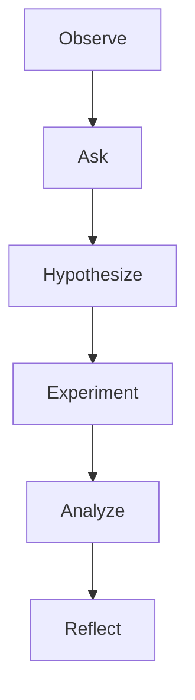

# Inquiry & Discovery Learning di SBA

Versi: 1.0.0
Riwayat Perubahan:

- 1.0.0 (2025-12-05): Penerapan inquiry/discovery di SBA.

## Prinsip

- Mengubah observasi event menjadi pemahaman melalui proses sistematis.
- Menolak menerima output agen secara mentah; verifikasi dan elaborasi.

## Tahapan

- Observe: tangkap event SSE/WS dan data CRUD.
- Ask: ajukan pertanyaan lanjutan, tantang asumsi.
- Hypothesize: bentuk hipotesis dan rencana tindakan.
- Experiment: jalankan run/aksi, rekam hasil.
- Analyze: bandingkan hasil dengan ekspektasi.
- Reflect: dokumentasikan insight dan keputusan.

## Pemetaan Modul

- apps/app: menyediakan kontrol dan stream untuk eksperimen cepat.
- apps/web: menyimpan hasil dan diskusi; kolaborasi.
- apps/api: validasi input dan menyediakan jalur eksekusi aman.

## Flowchart

## Indikator Keberhasilan

- Siklus inquiry lengkap; outcome nyata; dokumentasi refleksi.
