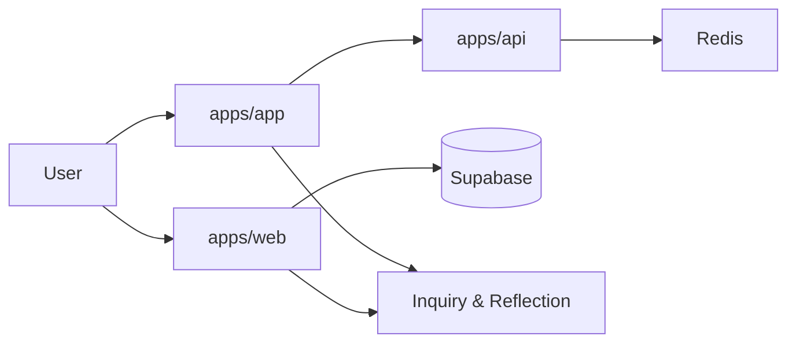

# Konteks Pembelajaran & Pencarian Pengetahuan SBA

Versi: 1.0.0
Riwayat Perubahan:

- 1.0.0 (2025-12-05): Inisialisasi konteks pembelajaran dan strategi inquiry untuk SBA.

## Tujuan

- Menyelaraskan filosofi pembelajaran mendalam (deep learning), pendekatan kontekstual (CTL), dan inquiry/discovery dengan arsitektur SBA (`apps/app`, `apps/web`, `apps/api`).

## Prinsip Pembelajaran

- Berkesadaran: proses belajar dengan tujuan dan alur yang jelas, fokus, dan reflektif.
- Bermakna: materi dikaitkan dengan konteks nyata (use case bisnis, data aktual, stream event agen).
- Menggembirakan: pengalaman interaktif (SSE/WS, realtime chat) memicu rasa ingin tahu.

## Inquiry & Questioning

- Dorong curiosity melalui dialog interaktif di antarmuka (chat, stream event), menantang asumsi dan mengkaji hipotesis.
- Transformasi observasi → pemahaman: data/event dari agen diproses menjadi insight melalui UI/SDK/services.

## Pemetaan ke Modul SBA

- `apps/app`: wadah eksplorasi agentic, memfasilitasi inquiry real-time (SSE/WS) dan tindakan (start/continue/cancel).
- `apps/web`: ruang belajar pengguna (chat/dokumen), menghubungkan materi dengan konteks nyata via Supabase.
- `apps/api`: fasilitator proses (validasi, kontrak, antrean) agar inquiry berjalan sistematis dan aman.

## Strategi Implementasi

- Use case berbasis proyek (project-based): orkestrasi runs sebagai “proyek” dengan problem nyata.
- Konstruktivis: pengguna membangun pengetahuan via percakapan dan stream, disokong oleh repos dan services.
- Kolaboratif: multi-tenant dan data bersama mendorong kerja tim dan berbagi wawasan.

## Pengukuran Keberhasilan

- Keterlibatan: jumlah interaksi chat/stream, durasi sesi, tingkat curiosity (pertanyaan lanjutan) via `sba_curiosity_total`.
- Kemendalaman: hubungan antara event → insight → tindakan; retensi informasi di percakapan/dokumen.
- Efektivitas: latensi stream, keberhasilan operasi, error rate rendah; stabilitas.

## Diagram Konteks

## Rencana Penguatan

- Mekanisme refleksi di UI tersedia melalui komponen InsightPanel (catatan insight, TODO tindakan, ekspor markdown, persistensi lokal).
- Integrasi analitik curiosity (jumlah pertanyaan, elaborasi).
- Shared typed contracts & realtime facade untuk pengalaman belajar konsisten.
