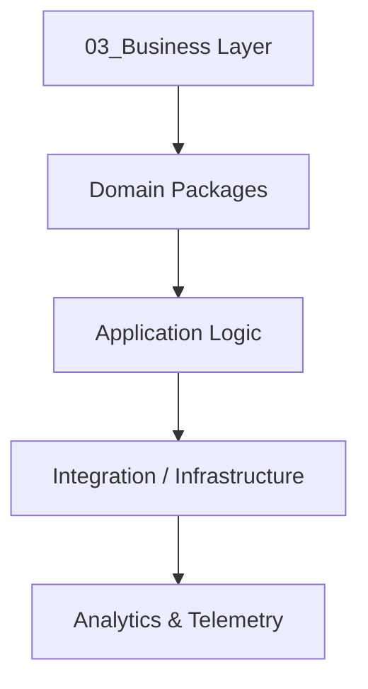

# 🧭 Business Architecture Overview

**Lokasi:** `docs/Business/00_Overview/business-architecture-overview.md`

## 1. Tujuan

Menetapkan panduan konseptual dan struktural bagi seluruh domain bisnis di sistem SBA-Agentic. Dokumen ini mendefinisikan prinsip desain, domain utama, dan keterhubungan antar-lapisan teknis.

## 2. Prinsip Desain

| Prinsip                        | Deskripsi                                                              |
| ------------------------------ | ---------------------------------------------------------------------- |
| **Domain-Driven Design (DDD)** | Setiap modul bisnis mewakili _bounded context_ yang jelas.             |
| **Agentic Adaptability**       | Logika bisnis dapat dieksekusi oleh AI Agent tanpa intervensi manusia. |
| **Separation of Concerns**     | Domain logic terpisah dari lapisan API dan UI.                         |
| **Observability by Design**    | Setiap proses memiliki telemetry dan feedback loop.                    |

## 3. Struktur Lapisan Bisnis

## 4. Domain Bisnis Utama

| Paket                     | Tujuan                               | Integrasi             |
| ------------------------- | ------------------------------------ | --------------------- |
| `@sba/business-chat`      | Manajemen percakapan agent-user.     | Agent Flows, API Chat |
| `@sba/business-knowledge` | Operasi knowledge base & retrieval.  | Supabase, Agent KB    |
| `@sba/business-analytics` | Insight & observability data bisnis. | Metrics Observability |
| `@sba/business-payment`   | Transaksi & subscription layer.      | RBAC, Stripe API      |

## 5. Peran Business Layer

- Mengonversi _user intent_ menjadi _domain command_.
- Mengatur orkestrasi antar agent dan domain.
- Menyediakan kontrak bisnis bagi API publik.
- Memonitor lifecycle aktivitas agentic melalui meta-events.

## 6. Relasi Antar Lapisan

| Layer        | Fokus               | Alur Utama        |
| ------------ | ------------------- | ----------------- |
| PRD          | Tujuan & KPI        | Ide → Use Case    |
| Architecture | Blueprint teknis    | ADR → Komponen    |
| Business     | Implementasi domain | Command → Event   |
| Agent-Flows  | Eksekusi            | BPMN → Orkestrasi |
| API          | Ekspose fungsi      | Endpoint → UI     |

## 7. Rencana Pengembangan

- 🔹 Fase 1: Konsolidasi domain inti (Chat, Knowledge)
- 🔹 Fase 2: Integrasi Analytics & Observability
- 🔹 Fase 3: Pembentukan Payment & Billing domain
- 🔹 Fase 4: AI-driven Decision Intelligence
