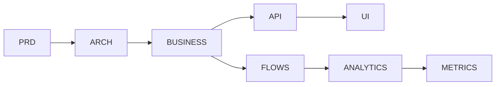

# 🌐 Integration Map

**Lokasi:** `docs/Business/00_Overview/integration-map.md`

## 1. Tujuan

Memetakan seluruh integrasi lintas lapisan dalam SBA-Agentic System antara Business Layer dengan Architecture, API, dan Agent Flows.

## 2. Diagram Integrasi

## 3. Jenis Integrasi

| Jenis                       | Deskripsi                     | Contoh Implementasi |
| --------------------------- | ----------------------------- | ------------------- |
| **Internal (Intra-Domain)** | Antar modul `@sba/business-*` | Chat ↔ Knowledge    |
| **External (Inter-System)** | Ke API publik atau database   | Supabase, Stripe    |
| **Agentic Integration**     | Eksekusi otomatis oleh agent  | Workflow BPMN       |
| **Telemetry**               | Feedback & observability      | Metrics, Heatmap    |

## 4. Aturan Integrasi

1. Semua integrasi harus melalui _Business Ports_ (adapter layer).
2. Agent hanya dapat berinteraksi melalui API yang telah dikontrak.
3. Setiap event lintas-domain wajib direkam dalam meta-event stream.
4. Integrasi baru harus disetujui melalui ADR.

## 5. Monitoring & Observability

Integrasi dilacak dengan:

- Event-driven metrics
- Audit log per transaksi
- Heatmap per domain agent
- Auto-feedback dari user / agent

## 6. Catatan Evolusi

Setiap perubahan arsitektur integrasi didokumentasikan dalam `02_Architecture/ADR-XXX.md`.
