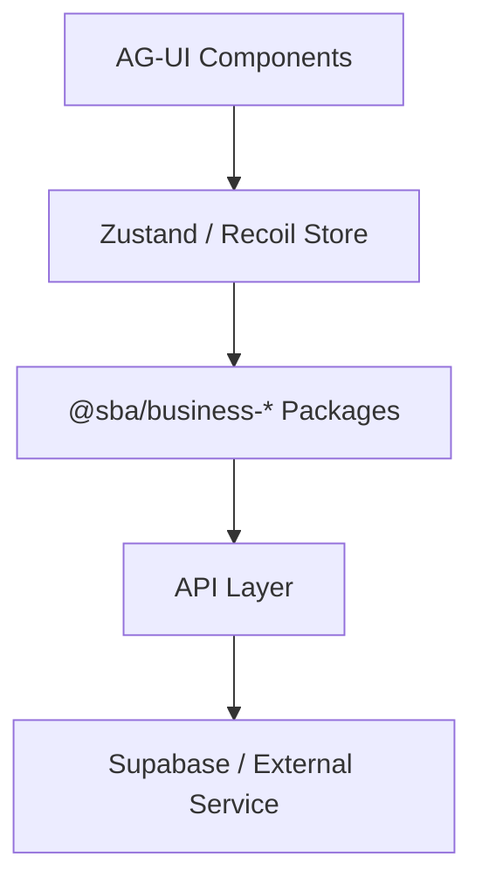
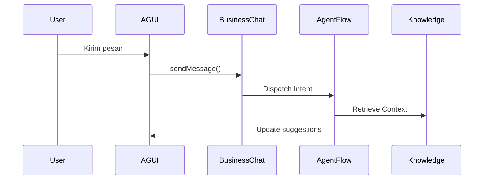

# 🎨 Design Integration Overview

**Lokasi:** `docs/Business/02_Design-Integration/design-integration-overview.md`

## 1. Tujuan

Mendefinisikan strategi dan kontrak integrasi antara **AG-UI Components** dengan **Business Logic Layer** pada SBA-Agentic system.

## 2. Arsitektur Integrasi



## 3. Prinsip Desain

| Prinsip                 | Deskripsi                                                      |
| ----------------------- | -------------------------------------------------------------- |
| **Declarative UI**      | Komponen UI hanya mendeklarasikan niat (intent).               |
| **State Derivation**    | Semua state bersumber dari domain business store.              |
| **Agent-Aware**         | Komponen dapat diaktifkan atau disesuaikan oleh Agent.         |
| **Design Token Driven** | UI sepenuhnya disinkronkan dengan token di `03_Design-System`. |

## 4. Komponen Utama

| Komponen               | Integrasi                   |
| ---------------------- | --------------------------- |
| **ChatPanel**          | → `@sba/business-chat`      |
| **KnowledgeBrowser**   | → `@sba/business-knowledge` |
| **AnalyticsDashboard** | → `@sba/business-analytics` |
| **BillingWidget**      | → `@sba/business-payment`   |

## 5. Mekanisme Binding

1. Komponen AG-UI menggunakan `useBusiness()` hook.
2. Hook memanggil state store dari package domain (`@sba/business-*`).
3. Semua perubahan state mengemisi `BusinessEvent` → dipantau oleh Agent.
4. Event ini diteruskan ke analytics layer untuk observability.

## 6. Contoh Integrasi

```tsx
import { useBusinessChat } from '@sba/business-chat';
import { ChatPanel } from 'ag-ui/chat';

export const AgenticChat = () => {
  const { messages, send } = useBusinessChat();
  return <ChatPanel messages={messages} onSend={send} />;
};
```

## 7. Alur Interaksi



## 8. Hasil yang Diharapkan

- Desain responsif dan agent-adaptive.
- UI dapat bereaksi terhadap event bisnis tanpa hard-coding.
- A/B testing berbasis telemetry (meta-events).
