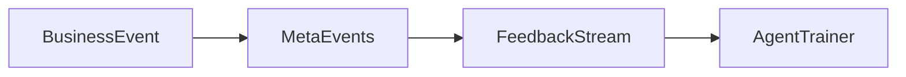

# 🧠 Agent Feedback Loop

**Lokasi:** `docs/Business/03_Agent-Flows/agent-feedback-loop.md`

## 1. Tujuan

Menguraikan mekanisme umpan balik dua arah antara Agent dan Business Layer.

## 2. Jenis Feedback

| Jenis                    | Sumber                     | Tujuan               |
| ------------------------ | -------------------------- | -------------------- |
| **Operational Feedback** | Event Log                  | Analytics Dashboard  |
| **Performance Feedback** | Latency & Accuracy Metrics | Agent Optimizer      |
| **User Feedback**        | Manual / Auto rating       | Meta-Events Feedback |

## 3. Mekanisme

1. Setiap `BusinessEvent` menghasilkan `FeedbackEvent`.
2. `FeedbackEvent` disimpan oleh meta-events pipeline.
3. Agentic Orchestrator mengkonsumsi feedback untuk pembelajaran ulang.

## 4. Contoh Implementasi

```ts
import { emitFeedback } from '@sba/shared-telemetry';

export const recordAgentFeedback = (event: BusinessEvent) => {
  emitFeedback({
    source: 'agentic',
    type: 'performance',
    payload: event.metrics,
  });
};
```

## 5. Visualisasi


