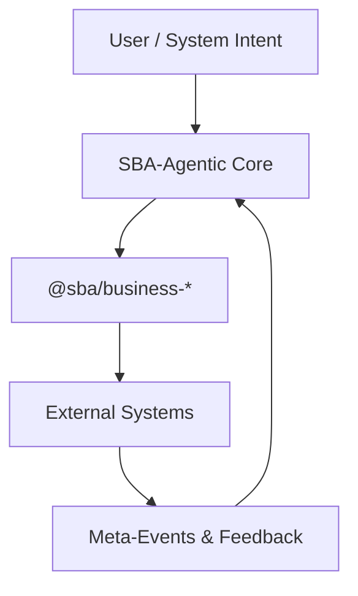
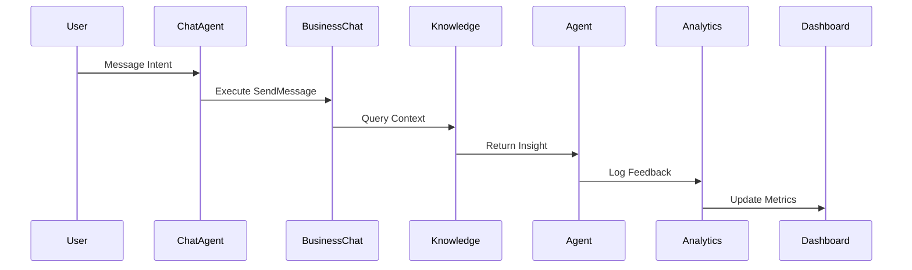

# 🤖 Agentic Flow Overview

**Lokasi:** `docs/Business/03_Agent-Flows/agentic-flow-overview.md`

## 1. Tujuan

Menjelaskan pola eksekusi agentic yang digunakan untuk menjalankan logika bisnis secara otomatis.

## 2. Pola Arsitektur

## 3. Mekanisme

1. Agent menerima _Intent_ dari Chat atau UI event.
2. Agent memilih _Business Use Case_ yang relevan.
3. Eksekusi dilakukan melalui _Business Command Handler_.
4. Event hasil dikirim ke meta-event untuk analisis.

## 4. Komponen Utama

| Komponen       | Deskripsi                                            |
| -------------- | ---------------------------------------------------- |
| `AgentRouter`  | Menentukan domain tujuan (chat, knowledge, payment). |
| `FlowEngine`   | Mengeksekusi BPMN / YAML flow.                       |
| `TelemetryHub` | Menyimpan hasil observasi agent.                     |

## 5. Contoh Alur

## 6. Event Standar

| Event              | Domain    | Deskripsi                |
| ------------------ | --------- | ------------------------ |
| `IntentReceived`   | Chat      | User input diterima      |
| `ContextRetrieved` | Knowledge | Konteks berhasil diambil |
| `FlowExecuted`     | Agentic   | Eksekusi BPMN selesai    |
| `FeedbackLogged`   | Analytics | Observasi disimpan       |
