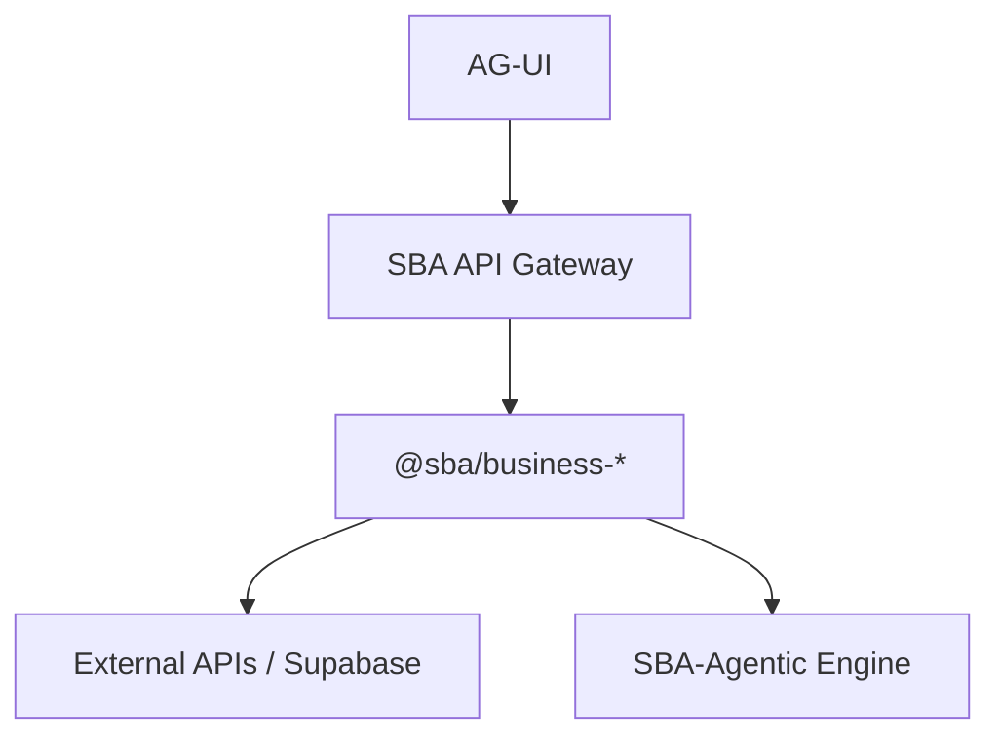

# 🔗 API Contracts Overview

**Lokasi:** `docs/Business/04_API-Contracts/api-contracts-overview.md`

## 1. Tujuan

Menstandarkan seluruh kontrak komunikasi antar package `@sba/business-*` dan eksternal API, agar integrasi agentic berjalan mulus.

## 2. Arsitektur Integrasi



## 3. Standar Desain

| Aspek              | Standar                   | Catatan                           |
| ------------------ | ------------------------- | --------------------------------- |
| **Format**         | JSON:API / REST / GraphQL | Disesuaikan kebutuhan domain      |
| **Versi**          | `/v1`, `/v2`              | Diatur melalui `api-version.json` |
| **Dokumentasi**    | OpenAPI 3.1               | Terintegrasi dengan Swagger-UI    |
| **Error Handling** | RFC 7807 (Problem JSON)   | Uniform untuk semua package       |

## 4. Prinsip Kontrak

- Semua endpoint memiliki **contract-first definition** (YAML/JSON).
- Business Layer tidak boleh mengubah format response tanpa revisi versi.
- Agent Engine mengonsumsi API berdasarkan manifest version.

## 5. Contoh Manifest

```json
{
  "apiVersion": "v1",
  "service": "business-chat",
  "basePath": "/api/business/chat",
  "endpoints": [
    { "path": "/send", "method": "POST" },
    { "path": "/history", "method": "GET" }
  ]
}
```
