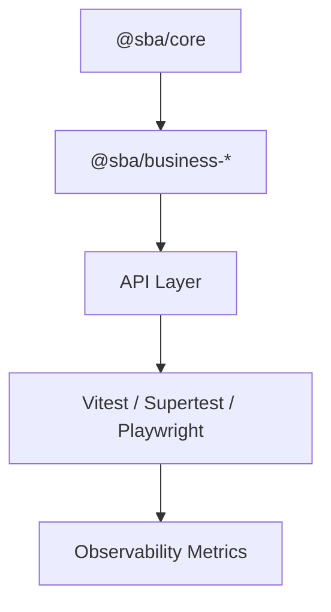

# 🧱 Test Architecture

**Lokasi:** `docs/Business/05_Testing-Validation/test-architecture.md`

## 1. Desain Lapisan Pengujian



## 2. Struktur Folder

```
tests/
├── unit/
├── integration/
├── e2e/
└── agentic/
```

## 3. Agentic Simulation Example

```ts
import { simulateAgentFlow } from '@sba/testing-agentic';

test('Agentic flow for payment verification', async () => {
  const result = await simulateAgentFlow({
    intent: 'verify_payment',
    domain: 'payment',
  });
  expect(result.status).toBe('success');
});
```

## 4. Reporting

- Gunakan `@sba/metrics-observability` untuk logging otomatis.
- Dashboard menampilkan test coverage per domain.
