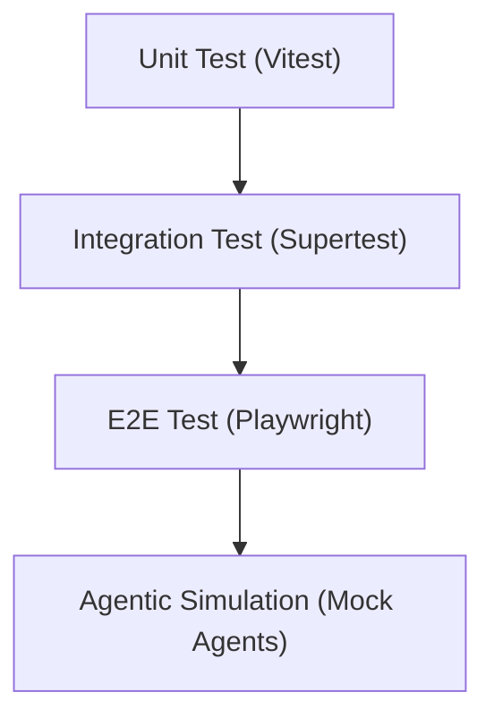

# ✅ Testing & Validation Overview

**Lokasi:** `docs/Business/05_Testing-Validation/testing-validation-overview.md`

## 1. Tujuan

Menjamin keandalan dan konsistensi dari seluruh domain bisnis SBA-Agentic.

## 2. Hirarki Pengujian

## 3. Level Pengujian

| Level                | Fokus                          | Tool           |
| -------------------- | ------------------------------ | -------------- |
| **Unit Test**        | Validasi fungsi domain         | Vitest         |
| **Integration Test** | Validasi API antar package     | Supertest      |
| **E2E Test**         | Validasi skenario bisnis penuh | Playwright     |
| **Agent Simulation** | Uji perilaku agentic loop      | Custom Harness |

## 4. Prinsip

- Setiap test idempotent & isolated
- Seluruh hasil test dikirim ke observability pipeline
- Agent dapat memvalidasi hasil melalui feedback meta-events
