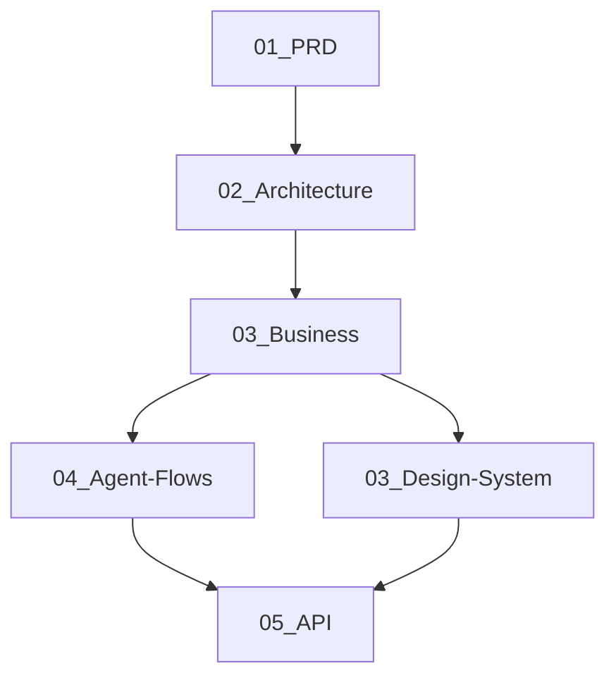
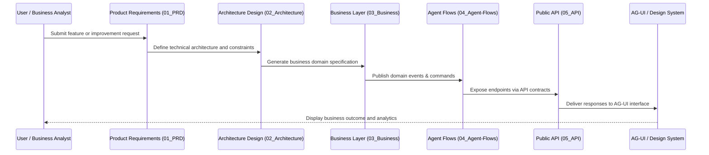

Sempurna ⚙️ — kita akan membangun **`docs/Business/`** sebagai _blueprint dokumentasi enterprise-grade_ yang menjadi penghubung seluruh lapisan dalam monorepo SBA-Agentic.
Struktur ini akan menyatukan _PRD → Architecture → Business → Design System → Agent-Flows → API_ dalam satu rantai dokumentasi berjenjang dan terintegrasi.

## Berikut versi **lengkap, profesional, dan siap implementasi**:

````markdown
# 🧭 SBA-Agentic Business Layer Documentation

**Lokasi:** `docs/Business/`  
**Versi:** 1.0.0  
**Tanggal:** 2025-12-12  
**Penanggung Jawab:** SBA Architecture Core Team

---

## 1. OVERVIEW: HUBUNGAN ANTAR LAPISAN

Struktur monorepo SBA-Agentic mengikuti arsitektur berlapis yang selaras antara _product vision_ dan _technical execution_:


````

| Layer                | Deskripsi                                          | Hasil Utama                       |
| -------------------- | -------------------------------------------------- | --------------------------------- |
| **01_PRD**           | Mendefinisikan kebutuhan bisnis dan user story     | Product Requirement Documents     |
| **02_Architecture**  | Menetapkan arsitektur sistem dan diagram C4        | ADR, Sequence, dan Dataflow       |
| **03_Business**      | Implementasi logika domain dan use case utama      | NPM Packages `@sba/business-*`    |
| **03_Design-System** | Desain UI komponen dan token visual AG-UI          | Tokens, Components, UX Guidelines |
| **04_Agent-Flows**   | Automasi proses dan orchestrasi antar domain       | BPMN, Flow Definition             |
| **05_API**           | Publikasi fungsi bisnis ke UI dan sistem eksternal | OpenAPI, Postman, Contracts       |

---

## 2. TUJUAN UTAMA

Lapisan `Business` berfungsi sebagai **penghubung strategis** antara ide bisnis (PRD) dan eksekusi teknis (Flows/API).

🎯 **Tujuan:**

1. Mewujudkan logika bisnis dalam bentuk modular, reusable, dan terautomasi.
2. Mengaktifkan _Agentic Intelligence Layer_ agar bisa mengeksekusi use case secara mandiri.
3. Menjamin semua proses dari UI → Agent → Domain → API konsisten dan terukur.
4. Menyediakan fondasi untuk AI Agent Builder menjalankan reasoning berbasis domain.

---

## 3. STRUKTUR DOKUMENTASI `docs/Business/`

```
docs/
└── Business/
    ├── 00_Overview/
    │   ├── business-architecture-overview.md
    │   ├── integration-map.md
    │   └── business-governance.md
    ├── 01_Packages/
    │   ├── ARSITEKTUR.md
    │   ├── business-core.md
    │   ├── business-chat.md
    │   ├── business-knowledge.md
    │   ├── business-payment.md
    │   ├── business-analytics.md
    │   └── shared-libraries.md
    ├── 02_Design-Integration/
    │   ├── ag-ui-bridge.md
    │   ├── component-to-domain-map.md
    │   └── design-token-flow.md
    ├── 03_Agent-Flows/
    │   ├── business-to-agent-map.md
    │   ├── bpmn-domain-actions.md
    │   └── agentic-loop.md
    ├── 04_API/
    │   ├── openapi-specification.md
    │   ├── api-contracts-overview.md
    │   └── business-api-contracts.md
    ├── 05_Testing/
    │   ├── test-architecture.md
    │   ├── testing-validation-overview.md
    │   └── validation-checklist.md
    └── README.md
```

---

## 4. ALUR TERPADU (PRD → API)



---

## 5. KETERHUBUNGAN DOKUMEN

| Layer             | Dokumentasi Utama                | Terhubung ke                 |
| ----------------- | -------------------------------- | ---------------------------- |
| **PRD**           | `01_PRD/*.md`                    | Business Feature Definitions |
| **Architecture**  | `02_Architecture/ADR-*.md`       | Domain Service Blueprint     |
| **Business**      | `03_Business/01_Packages/*.md`   | Agent Flow & API Contracts   |
| **Design-System** | `03_Design-System/Foundations/*` | AG-UI Rendering Layer        |
| **Agent-Flows**   | `04_Agent-Flows/bpmn/*.bpmn`     | Business Command Mapping     |
| **API**           | `05_API/openapi*.yaml`           | External System Interface    |

---

## 6. KOMPONEN TEKNIS BISNIS (LAYERS)

### A. Domain Layer

- **Entities** → representasi nyata objek bisnis.
- **Aggregates** → pengendali konsistensi antar entitas.
- **Value Objects** → tipe nilai tak berubah.
- **Domain Events** → sinyal antar proses agentic.

### B. Application Layer

- **Use Cases / Commands** → aksi utama sistem.
- **Queries** → operasi pembacaan domain.
- **Event Handlers** → sinkronisasi antar modul.

### C. Interface Layer

- **Ports / Adapters** → jembatan ke API, database, UI, dan sistem eksternal.
- **DTOs** → struktur data yang dikirim antar layer.

---

## 7. TEKNOLOGI YANG DIGUNAKAN

| Komponen    | Teknologi                                | Tujuan                               |
| ----------- | ---------------------------------------- | ------------------------------------ |
| **Bahasa**  | TypeScript                               | Type-safety dan integrasi AI Builder |
| **Bundler** | Turborepo + tsup                         | Modular monorepo build               |
| **Testing** | Jest / Vitest                            | Unit & Integration Testing           |
| **Linting** | ESLint + Prettier                        | Konsistensi kode                     |
| **Docs**    | MkDocs / Docusaurus                      | Dokumentasi otomatis                 |
| **API**     | OpenAPI 3.1 + Swagger                    | Deskripsi kontrak service            |
| **CI/CD**   | GitHub Actions + Vercel + PNPM Workspace | Integrasi & deploy otomatis          |

---

## 8. DIAGRAM ARSITEKTUR TERPADU

```mermaid
graph TB
    subgraph PRD["01_PRD – Product Requirements"]
      F1[Feature Specs] --> F2[Change Requests]
    end

    subgraph ARCH["02_Architecture – System Design"]
      A1[ADR Docs]
      A2[Component Diagrams]
    end

    subgraph BIZ["03_Business – Domain Layer"]
      B1[@sba-business-chat]
      B2[@sba-business-knowledge]
      B3[@sba-business-payment]
      B4[@sba-business-analytics]
    end

    subgraph FLOW["04_Agent-Flows – BPMN / Agentic Engine"]
      L1[Agent Flow Definitions]
    end

    subgraph API["05_API – Integration Contracts"]
      P1[OpenAPI Specs]
    end

    subgraph UI["03_Design-System – AG-UI"]
      D1[Components]
      D2[Tokens]
    end

    F1 --> A1
    A1 --> BIZ
    BIZ --> FLOW
    FLOW --> API
    API --> UI
```

---

## 9. PENGUJIAN DAN VALIDASI

- **Unit Tests**: Fokus pada domain logic (`03_Business/04_Testing`)
- **Integration Tests**: Business-to-Agent dan Business-to-API
- **End-to-End Tests**: Melalui Agentic Flow Executor (BPMN-based)
- **Quality Metrics**: >80% coverage, 0 circular dependency, <100ms latency (domain call)

---

## 10. GOVERNANCE & MAINTENANCE

- Semua perubahan bisnis harus melewati proses _Architecture Decision Record (ADR)_.
- Setiap modul `@sba/business-*` memiliki _Owner_ dan _Maintainer_.
- `docs/Business/00_Overview/integration-map.md` wajib diperbarui saat integrasi baru dibuat.
- Rilis mengikuti **SemVer** dan dirilis melalui **changeset automation**.

---

## 11. RENCANA EVOLUSI

| Fase        | Fokus                               | Hasil                             |
| ----------- | ----------------------------------- | --------------------------------- |
| **Q4 2025** | Pembentukan domain core             | Chat, Knowledge, Analytics stable |
| **Q1 2026** | Integrasi penuh AG-UI & SBA-Agentic | Multi-agent reasoning pipeline    |
| **Q2 2026** | Observability & auto-feedback       | Self-optimizing agentic loop      |
| **Q3 2026** | Multi-tenant orchestration          | AI-per-tenant intelligence        |

---

## 12. KESIMPULAN

Lapisan `Business` adalah **tulang punggung operasional SBA-Agentic**,
menghubungkan **visi bisnis** dengan **eksekusi teknis agentic**,
memastikan setiap keputusan domain dapat dijalankan, dimonitor, dan dikembangkan oleh sistem AI yang otonom.

> _"From PRD to Production, every agentic decision passes through the Business Layer."_

---

📘 **Dokumen ini adalah referensi inti untuk semua pengembang, arsitek, dan AI Agent Builder yang bekerja dengan domain bisnis SBA-Agentic.**
