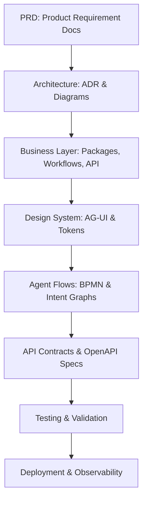

# SBA-Agentic — Business Overview (Visi, Misi, Value Proposition)

**Versi:** 1.1.0  
**Tanggal:** 2025-12-12  
**Riwayat Perubahan:**

- 1.1.0 (2025-12-12): Pembaruan menyeluruh sesuai struktur `docs/Business` dan integrasi AG-UI & SBA-Agentic Core.
- 1.0.0 (2025-12-05): Draft awal overview bisnis.

---

## 🌐 Visi

Menjadi **Operating System Bisnis AI-Native**, yang memungkinkan organisasi membangun, mengelola, dan mengembangkan _agentic copilots_ untuk mengotomatisasi proses bisnis, memperkuat pengambilan keputusan, dan membangun **memori operasional kolektif** di seluruh organisasi.

> “SBA-Agentic adalah jembatan antara manusia, proses, dan kecerdasan kolektif organisasi.”

---

## 🎯 Misi

1. **Menyediakan platform multi-tenant adaptif** yang menyatukan:
   - **AG-UI (Agentic User Interface)** — antarmuka dinamis berbasis agen yang menyesuaikan konteks pengguna dan bisnis.
   - **Business Knowledge Hub (Knowledge Base)** — penyimpanan terstruktur SOP, playbook, dan dokumen operasional.

2. **Menyediakan automasi manusiawi (_human-in-the-loop_)** dengan:
   - Observabilitas penuh terhadap setiap alur kerja (meta-events, metrics, logs).
   - Keamanan enterprise-grade (RBAC, secret-shield, tenant isolation).
   - Kontrol orkestrasi agentik terukur (pause/resume/introspect).

3. **Menyatukan konteks lintas domain bisnis** — memungkinkan _Copilot Operasional_ untuk bekerja di HR, Finance, SalesOps, Marketing, dan Operation secara real-time.

---

## 💎 Value Proposition

| Pilar Nilai                   | Deskripsi                                                                            | Dampak                                                        |
| ----------------------------- | ------------------------------------------------------------------------------------ | ------------------------------------------------------------- |
| **Business Knowledge Hub**    | Repositori SOP dan playbook yang dapat dieksekusi sebagai workflow interaktif.       | Meningkatkan konsistensi & dokumentasi proses.                |
| **Smart Workflow Automation** | Otomasi no-code/low-code berbasis konteks dan event-driven.                          | Mempercepat efisiensi lintas tim tanpa developer dependency.  |
| **Copilots Operasional**      | Agentic copilots dengan memori jangka panjang dan pemahaman domain.                  | Mendukung keputusan real-time dan insight berbasis data.      |
| **Integration Hub**           | Konektor ke tools eksternal (Notion, Slack, Supabase, CRM, ERP).                     | Memudahkan orkestrasi lintas sistem tanpa coding manual.      |
| **Business Observability**    | Dashboard dan panel insight untuk metrics, anomaly detection, dan trend operasional. | Memberikan visibilitas penuh dan feedback loop berkelanjutan. |

---

## 🧩 Positioning & Keunggulan

| Aspek          | SBA-Agentic                                     | Platform AI Biasa            |
| -------------- | ----------------------------------------------- | ---------------------------- |
| Arsitektur     | Modular, Agentic, Event-Driven                  | Monolitik / Integrasi manual |
| UI             | AG-UI (adaptive & context-aware)                | Form-based static            |
| Memori         | Operational Memory Layer                        | Stateless                    |
| Automasi       | Workflow interaktif berbasis agen               | Rule-based automation        |
| Observabilitas | Meta-events + metrics pipeline                  | Logging tradisional          |
| Skalabilitas   | Multi-tenant adaptive (Supabase + Edge Runtime) | Single-tenant rigid          |

---

## 💼 Segmentasi & Pricing (Ringkas)

| Segmen                 | Deskripsi                                       | Pendekatan                                              |
| ---------------------- | ----------------------------------------------- | ------------------------------------------------------- |
| **UMKM**               | Otomasi sederhana dan dashboard operasional     | Paket “Starter” (AG-UI + Business Knowledge Hub Basic)  |
| **Startup / Scale-up** | Multi-domain workflow & analytics               | Paket “Growth” (AG-UI + Workflow Agentic)               |
| **Enterprise Lite**    | Integrasi multi-tenant dan observabilitas penuh | Paket “Enterprise” (RBAC + Meta-Events + Observability) |

> Pricing bersifat modular — _tiering_ ditentukan oleh jumlah user, kompleksitas workflow, dan volume event agentic.

---

## 🔗 Hubungan Antar Lapisan Sistem



> Semua lapisan saling terkait dan membentuk _Agentic System Lifecycle_ dari ide hingga eksekusi dan optimasi.

---

## ⚙️ Integrasi Kunci

| Komponen                   | Peran                             | Implementasi               |
| -------------------------- | --------------------------------- | -------------------------- |
| **AG-UI**                  | Antarmuka agentic yang adaptif    | React + Zustand + Tailwind |
| **SBA-Agentic Core**       | Orkestrator alur & agent loop     | Node.js + TypeScript       |
| **Business Knowledge Hub** | Manajemen konten & SOP            | Supabase + Vector Index    |
| **Observability Layer**    | Monitoring meta-events & metrics  | Upstash + OpenTelemetry    |
| **Security & Governance**  | RBAC, Tenant Header, Secret Guard | Middleware & CI Guard      |

---

## 🧠 Nilai Strategis

- Membangun **memori kolektif organisasi** berbasis agentic loop.
- Mengurangi _context switching_ dengan **UI yang beradaptasi otomatis** terhadap peran dan aktivitas.
- Menjadikan setiap proses bisnis dapat **diaudit, dijelaskan, dan direkomendasikan** secara cerdas oleh AI.
- Mendorong organisasi menjadi **self-optimizing enterprise**.

---

## 🧩 Rujukan Internal

- `.trae/documents/Use-Case & Ide SaaS untuk Smart Business Assistant (SBA).md`
- `docs/Business/00_Overview/`
- `docs/Business/02_Design-Integration/`
- `docs/Business/04_API-Contracts/`
- `docs/Business/05_Testing-Validation/`

---

© 2025 SBA-Agentic — _Cognitive Infrastructure for Modern Business._

---

### 🔍 Penjelasan Tambahan

- Dokumen ini kini menjadi **entry point utama domain bisnis** di seluruh ekosistem SBA-Agentic.
- Menyelaraskan visi-misi dengan arsitektur AG-UI, Business Knowledge Hub, dan Agentic Core.
- Terhubung langsung ke setiap lapisan lifecycle melalui referensi lintas dokumen.
- Cocok ditempatkan di:

```

docs/
└── business/
└── overview.md

```

## 🔧 Desain Teknis Terpadu

### Diagram Arsitektur Sistem

```mermaid
graph TB
  subgraph UI[AG-UI]
    UI1[Dashboard]
    UI2[Chat]
  end

  subgraph Business[Packages/Business]
    BA[@sba/business-analytics]
    BC[@sba/business-chat]
    BK[@sba/business-knowledge]
    BP[@sba/business-payment]
    BCore[@sba/business-core]
  end

  subgraph Obs[Observability]
    O1[Metrics]
    O2[Logger]
    O3[Tracer]
  end

  UI1 --> BA
  UI2 --> BC
  BC --> BA
  BC --> BK
  BP --> BA
  BA --> Obs
  BC --> Obs
  BK --> Obs
  BP --> Obs
  BCore --> BA
  BCore --> BC
  BCore --> BK
  BCore --> BP
```

### Spesifikasi Modul Utama

- `@sba/business-core`: `EventBus` dengan `publishWithMeta`, `Result`, `Command/Query` handler generik.
- `@sba/business-analytics`: `GetMetricsHandler`, `LogEventHandler` mem-publish `AnalyticsEventLogged`, adapter `AGUIDashboardAdapter` membaca `tenantId`.
- `@sba/business-chat`: `ChatService`, `SendMessageHandler` meneruskan `tenantId/traceId`, event `ChatMessageSent` berisi `meta`.
- `@sba/business-knowledge`: `ContextEngine` + `RetrieveContextHandler` dengan repository abstraksi dan in-memory seed.
- `@sba/business-payment`: `PaymentGatewayService` + `StripeAdapter` idempotensi di tingkat gateway; webhook-ready.

### Alur Integrasi Antar Komponen

- AG-UI memicu `EventBus.publishWithMeta('DashboardRefresh', {meta: {tenantId}})` → `AGUIDashboardAdapter` konsumsi dan kirim update via `window.dispatchEvent('agui:dashboard:update')`.
- Chat mengirim `SendMessage` → repo → publish `ChatMessageSent` dengan `meta` → Analytics mendengar/record → Observability metrics/log.
- Knowledge retrieval mengkaya chat context → mempengaruhi metrik interaksi.
- Payment mengeksekusi transaksi → publish events → analytics & observability.

### Standar Kode & Pengujian

- TypeScript ketat, tanpa any tidak diperlukan, `Result` untuk error.
- Event selalu memiliki `meta` opsional: `tenantId`, `traceId`.
- Coverage target: ≥80%, lint bebas error, type-check lolos.
- Nama ekspor konsisten melalui `src/index.ts` setiap package.

### Timeline Pengembangan

- Minggu 1: Foundation core + meta events, adapter dashboard.
- Minggu 2: Chat tenant-aware, integrasi analytics dasar.
- Minggu 3: Knowledge retrieval + observability hook.
- Minggu 4: Payment gateway + end-to-end validation, tuning.
