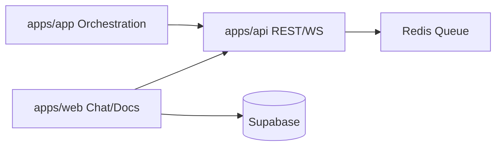

# SBA Marketing Overview

Versi: 1.0.0
Riwayat Perubahan:

- 1.0.0 (2025-12-05): Dokumen marketing terstruktur untuk penyelarasan produk-teknis.

Stakeholder:

- CEO/Founder, Product Marketing, Sales, Partnerships, Tech Lead, Customer Success.

## Value Proposition

- Smart Business Assistant (SBA) menyatukan orkestrasi AI-agent (apps/app), pengalaman end-user (apps/web), dan kontrak backend (apps/api) untuk mempercepat pengambilan keputusan dan otomatisasi proses bisnis secara real-time.

## Persona & Pain Points

- Decision Maker (Ops/CS/Marketing): butuh insight cepat dari chat/dokumen, aksi otomatis.
- Developer/Integrator: butuh orkestrasi runs, streaming event stabil, kontrak API jelas.
- Analyst: butuh audit trail, observability, dan reliabilitas data.

## Messaging & Positioning (per modul)

- apps/app: “Kontrol penuh orkestrasi AI-agent dengan streaming real-time yang handal.”
- apps/web: “Antarmuka chat/dokumen modular yang siap diintegrasikan ke proses bisnis.”
- apps/api: “Kontrak backend robust dengan multi-tenant, antrean, dan observability.”

## Fitur Utama (mapped ke modul)

- Orkestrasi Run (apps/app + apps/api)
- Chat/Dokumen & Realtime (apps/web + Supabase)
- Streaming SSE/WS (apps/app + apps/api)
- Multi-tenant & Security (apps/api + apps/web)

## Keunggulan Kompetitif

- Streaming stabil (SSE/WS + fallback) dan arsitektur terpisah untuk skalabilitas.
- FSD di frontend untuk maintainability; OpenAPI kontrak; observability siap.

## KPI & Metrics

- Time-to-Value: < 1 hari integrasi dasar.
- Uptime streaming: ≥ 99%.
- Latensi p50 start run: < 300–500ms.
- P95 realtime chat deliver: < 2s.

## GTM & Funnel (ringkas)

- Awareness: demo streaming (apps/app + apps/api).
- Consideration: PoC chat/dokumen (apps/web + Supabase).
- Conversion: integrasi API + SLA observability.

## Roadmap Ringkas

- Shared typed clients dari OpenAPI.
- Facade realtime lintas-frontend.
- Contract tests & CI peningkatan kualitas.

## Diagram Funnel/Arsitektur

## Referensi Teknis

- SSE client: `apps/app/src/shared/api/sse.ts:64,135-156`
- REST runs: `apps/api/src/api/runs.controller.ts:32,163,273,428,589`
- Supabase client: `apps/web/src/shared/api/client.ts:1-156,245-263`
