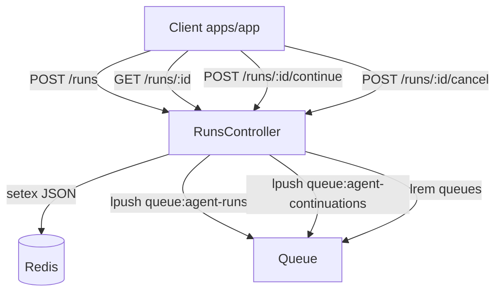
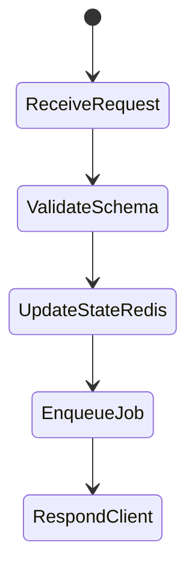

# Modul: apps/api (NestJS Orchestrator)

Versi: 1.0.0
Riwayat Perubahan:

- 1.0.0 (2025-12-05): Dokumen awal use case dan alur.

## Peran & Tanggung Jawab

- Menyediakan kontrak REST multi-tenant untuk lifecycle agent runs.
- Menyediakan gateway WebSocket untuk streaming event agen.
- Orkestrasi antrean (Redis/BullMQ) dan integrasi observability.
- Persistence ke Supabase Postgres melalui Prisma.

## Fitur Utama

- Runs: start/get/continue/cancel/list dengan validasi dan state sementara di Redis.
- WebSocket gateway: stream event ke klien.
- Swagger/OpenAPI: dokumentasi kontrak REST.
- Queue workers untuk pemrosesan asinkron.

## Integrasi

- Frontend apps/app: REST + SSE/WS konsumsi event.
- Frontend apps/web: endpoint AG-UI (chat) dan data via Supabase.
- Supabase: Prisma schema, migrasi, operasi data.
- Redis: antrean runs dan continuations.

## Persyaratan Teknis & Dependensi

- NestJS, Express, Socket.IO, BullMQ, Prisma, Supabase SDK, OpenTelemetry, ioredis.

## Tujuan Implementasi

- Start run p50 < 300ms, p95 < 800ms; queue enqueue < 50ms.
- Keberhasilan validasi schema 100% untuk permintaan valid; multi-tenant enforcement konsisten.

## Batasan & Lingkup

- State sementara (Redis) TTL 24 jam; persistence jangka panjang via DB.
- WS hanya untuk event agen; bukan channel CRUD Supabase.

## Error Handling

- `HttpException` dengan kode spesifik (VALIDATION_ERROR, RUN_NOT_FOUND, TENANT_ACCESS_DENIED, INTERNAL_ERROR).
- Penggunaan Zod schema untuk transform/whitelist; pengecekan UUID.

## Logging & Monitoring

- OpenTelemetry metrics (`metrics.requestCounter`, `metrics.agentRunCounter`), tracing spans.
- Logging status run dan enqueue/cancel queue.

## Kontribusi ke SBA

- Menjadi pusat kontrak dan orkestrasi agentic, memastikan integritas multi-tenant dan performa.

## Interaksi dengan Modul Lain

- Dihubungi oleh apps/app (REST/SSE/WS) dan apps/web (AG-UI endpoint).
- Menulis/membaca data dari Supabase via Prisma; memakai Redis untuk antrean.

## Skalabilitas & Maintainability

- Penggunaan antrean memastikan skalabilitas pemrosesan.
- Pemisahan controller, gateway, infrastructure modules mendukung maintainability.

## Kepatuhan Kualitas & Keamanan

- Guard Tenant, header `X-Tenant-ID`; validation pipe; Swagger untuk visibilitas.
- Hindari kebocoran rahasia; kontrol akses.

## Skenario Utama

- Start run → simpan ke Redis → enqueue → gateway siap stream.
- Continue run → update langkah → enqueue continuation.
- Cancel run → update status → hapus dari queue.
- List runs → filter/sort/paginate.

## Skenario Alternatif & Pengecualian

- Invalid UUID → BAD_REQUEST.
- Run expired → NOT_FOUND.
- Tenant access denied → FORBIDDEN.

## Acceptance Criteria

- Endpoint runs memenuhi kontrak dan menghasilkan status tepat.
- Queue operasi berhasil untuk start/continue/cancel.
- Metrics/logging tersedia untuk setiap request.

## Test Plan

- Unit: controller validation, uuid check, error mapping.
- Integration: Redis ops (setex, sadd, lpush, lrange/lrem), Prisma.
- E2E: alur start/continue/cancel/list dengan guard tenant.

## Diagram Flowchart



## Diagram Use Case (UML teks)

```
Actors: apps/app, apps/web
Use Cases:
- Start Agent Run
- Continue Agent Run
- Cancel Agent Run
- List Agent Runs
- Stream Agent Events (WS)
Relationships: Clients <-> REST/WS API <-> Redis/Prisma
```

## Diagram Sequence

```mermaid
sequenceDiagram
  participant Client as apps/app
  participant API as apps/api
  participant Redis as Redis
  Client->>API: POST /api/v1/runs
  API->>Redis: setex run:ID JSON
  API->>Redis: sadd tenant:ID:runs
  API->>Redis: lpush queue:agent-runs
  API-->>Client: 201 run JSON
  Client->>API: POST /runs/:id/continue
  API->>Redis: get run:ID; update; setex
  API->>Redis: lpush queue:agent-continuations
  API-->>Client: 200 run JSON
```

## Diagram Activity



## Referensi Teknis

- `apps/api/src/api/runs.controller.ts:32,163,273,428,589`
- `apps/api/src/api/gateway/*`
- `apps/api/docs/openapi.yaml`
