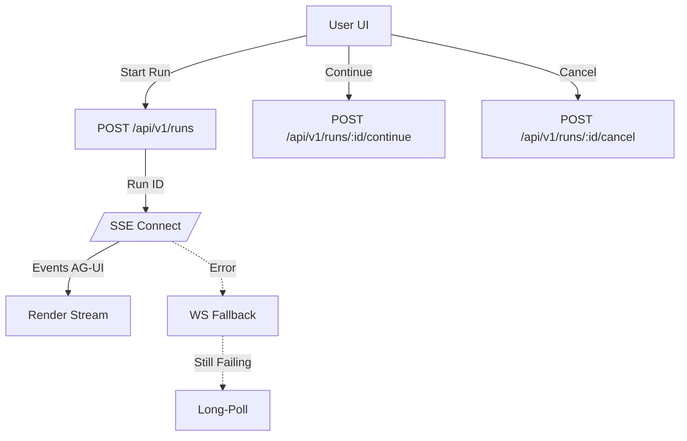
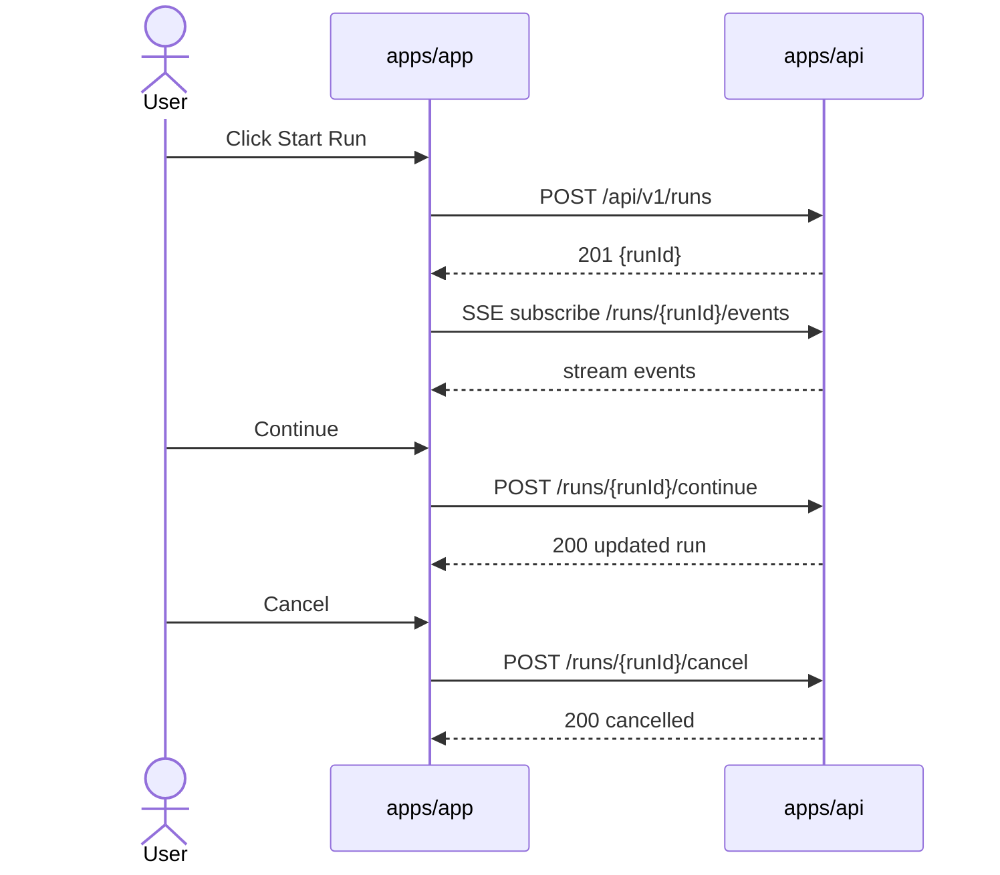
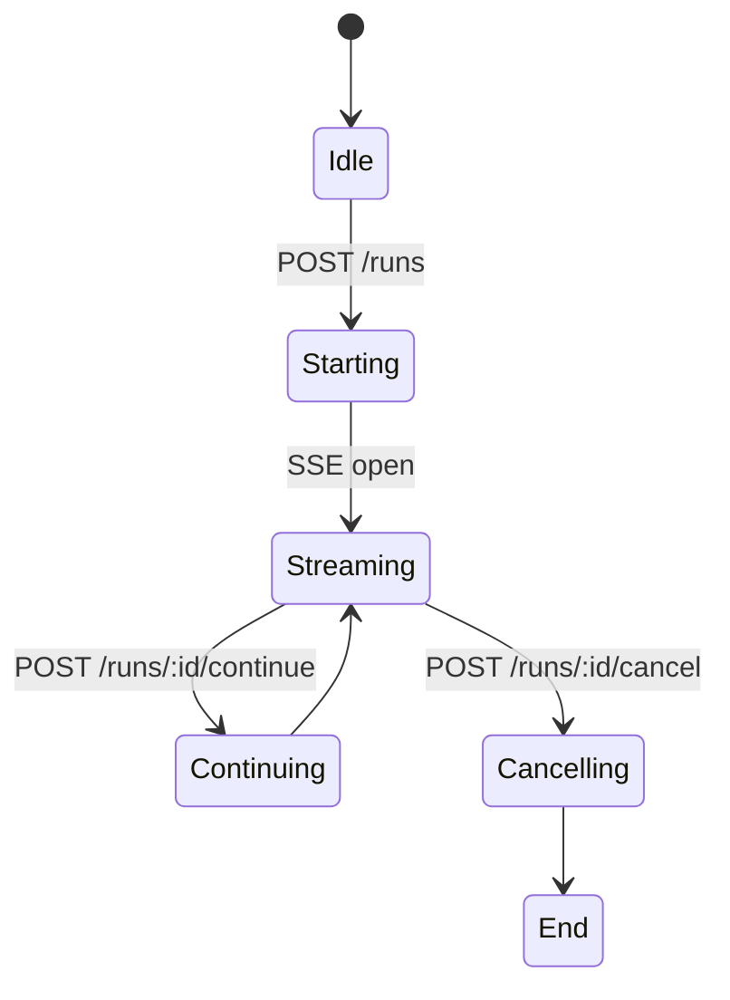

# Modul: apps/app (Next.js 15)

Versi: 1.0.0
Riwayat Perubahan:

- 1.0.0 (2025-12-05): Dokumen awal use case dan alur.

## Peran & Tanggung Jawab

- Orkestrasi UI untuk agent runs: memulai, melanjutkan, membatalkan, dan memantau.
- Streaming event AG-UI: konsumsi SSE/WS, pemetaan event, dan visualisasi.
- API routes lokal: proxy ke AG-UI, events per-run, health/metrics.
- Tidak mengelola persistence utama; bergantung pada backend dan Supabase paket bersama.

## Fitur Utama

- Start/Continue/Cancel Run (via REST ke API backend).
- Real-time stream (SSE/WS) untuk agent/tool/stream events.
- Proxy AG-UI endpoint untuk streaming JSON/Teks.
- Status heartbeat, reconnect, long-poll fallback.
- UI komponen reusable (`@sba/ui`) dan state (`zustand`, Query).

## Integrasi

- Backend `apps/api`: REST `/api/v1/runs/*`, SSE/WS gateway.
- Shared `@sba/*`: UI, utils, SDK, supabase.

## Persyaratan Teknis & Dependensi

- Next.js 15, React 18, TanStack Query, zod, zustand, tailwind-merge, lucide-react, framer-motion.
- Transpile paket: `@sba/ui`, `@sba/shared`, `@sba/utils`, `@sba/sdk`, `@sba/supabase`, `@sba/integrations`.

## Tujuan Implementasi

- T90% event AG-UI diterima < 2s, reconnect < 10s, 99% uptime stream.
- Start run latensi p50 < 500ms terhadap API.

## Batasan & Lingkup

- Tidak melakukan CRUD utama; hanya proxy dan konsumsi stream.
- WS fallback digunakan ketika SSE gagal; bukan channel utama.

## Error Handling

- Retry eksponensial (REST), timeout 30s, parse-safe JSON, heartbeat timeout; fallback long-poll.
- Skema error konsisten (`ApiError`) dan `errorResponseSchema`.

## Logging & Monitoring

- Client-side logging untuk event `open/close/error/heartbeat`.
- Integrasi metrics via API endpoints (health/metrics), observability dari backend.

## Kontribusi ke SBA

- Memberi UX real-time stabil untuk agentic orchestration.
- Memisahkan concerns presentasi dari kontrak backend.

## Interaksi dengan Modul Lain

- Memanggil REST `apps/api` untuk lifecycle run.
- Menggunakan paket `@sba/*` (UI/SDK/supabase) untuk konsistensi.

## Skalabilitas & Maintainability

- SSE/WS facade terpisah, mudah diganti; UI modular.
- Konfigurasi lewat `env` dan feature flags.

## Kepatuhan Kualitas & Keamanan

- Hindari logging rahasia; header multi-tenant (`X-Tenant-ID`) saat perlu.
- Validasi response dengan zod bila relevan.

## Skenario Utama

- Memulai run dan menerima stream event sampai selesai.
- Melanjutkan run dengan input user.
- Membatalkan run dan memutus stream.

## Skenario Alternatif & Pengecualian

- SSE gagal → WS fallback → long-poll.
- Run tidak ditemukan/tenant-denied → menampilkan error UX.

## Acceptance Criteria

- Dapat melakukan start/continue/cancel run dan menampilkan status real-time.
- SSE reconnect bekerja hingga `maxReconnectAttempts`.
- Proxy AG-UI mengembalikan stream sesuai spesifikasi.

## Test Plan

- Unit: parsing message/event types, retry, timeout.
- Integration: start/continue/cancel terhadap API mock, SSE stream simulasi.
- E2E: user flow start-run → stream → finish; error-path SSE gagal.

## Diagram Flowchart



## Diagram Use Case (UML teks)

```
Actors: User
Use Cases:
- Start Run
- Continue Run
- Cancel Run
- View Stream Events
Relationships: User <-> apps/app UI <-> apps/api (REST/WS/SSE)
```

## Diagram Sequence



## Diagram Activity



## Referensi Teknis

- `apps/app/src/shared/api/sse.ts:64,135-156,356-434,517-595`
- `apps/app/src/shared/api/client.ts:20-27,116-154,228-234`
