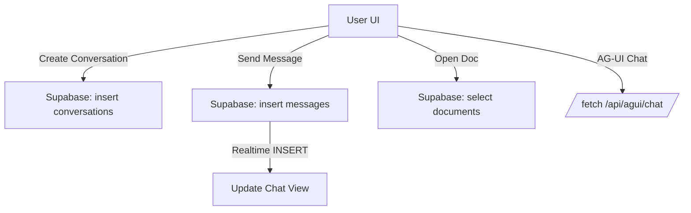
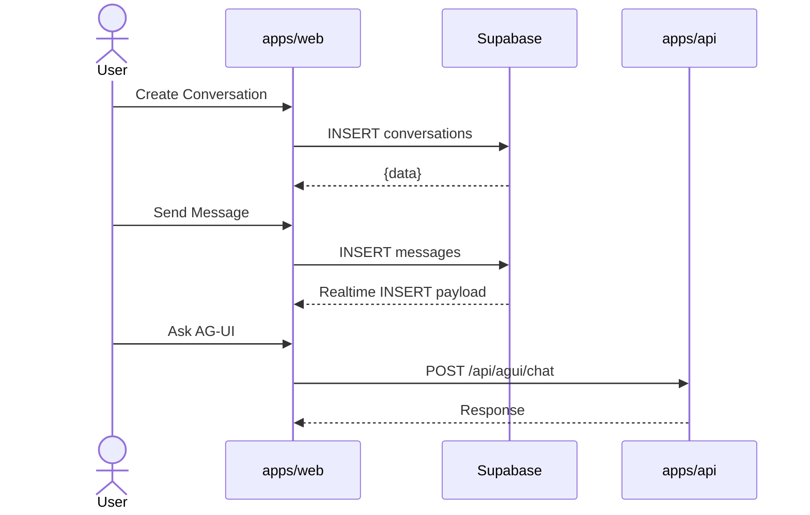
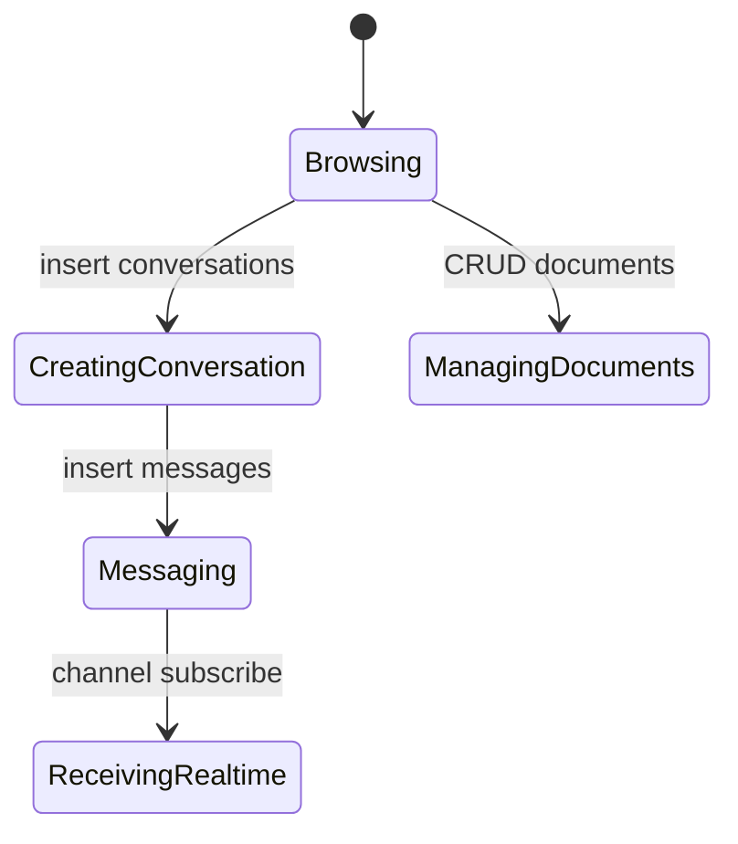

# Modul: apps/web (Next.js 14 + Supabase)

Versi: 1.0.0
Riwayat Perubahan:

- 1.0.0 (2025-12-05): Dokumen awal use case dan alur.

## Peran & Tanggung Jawab

- Aplikasi end-user untuk chat, percakapan, dokumen, dan workflow.
- Persistence CRUD dan realtime menggunakan Supabase.
- FSD layering: entities, features, widgets, shared, processes, pages.

## Fitur Utama

- Conversations CRUD (list, get, create, update, delete).
- Messages CRUD + realtime subscription per conversation.
- Documents CRUD.
- Tenants (get/getBySlug) untuk multi-tenant routing.
- Integrasi endpoint AG-UI internal untuk chat.

## Integrasi

- Supabase: `@sba/supabase` untuk client creation dan channel realtime.
- Backend API: endpoint internal `/api/agui/chat` untuk AG-UI.
- Shared packages: `@sba/ui`, `@sba/utils`, `@sba/entities`, `@sba/services`, `@sba/auth`, `@sba/agui-client`.

## Persyaratan Teknis & Dependensi

- Next.js 14, React 18, TanStack Query, zod, zustand, tailwind, date-fns.
- Playwright untuk e2e; Vitest untuk unit.

## Tujuan Implementasi

- Latensi CRUD p50 < 300ms; realtime delivery p95 < 2s.
- Konsistensi data tenant; failure rate insert < 1%.

## Batasan & Lingkup

- Tidak mengelola antrean agentic; fokus feature end-user.
- Channel realtime berbasis Postgres changes; bukan SSE/WS gateway backend.

## Error Handling

- Supabase response {data,error} diperiksa; fallback mock untuk Playwright/CI (`apps/web/src/shared/api/client.ts:3-15,48-156`).
- Validasi input dengan zod di service layer.

## Logging & Monitoring

- Client-side logging untuk error Supabase; integrasi analitik UI.
- Observability backend tidak langsung; pantau e2e hasil.

## Kontribusi ke SBA

- Menyediakan antarmuka pengguna utama untuk interaksi data dan chat.
- Menjaga modularitas fitur via FSD agar mudah berkembang.

## Interaksi dengan Modul Lain

- Memanggil AG-UI endpoint di `apps/api` untuk chat.
- Berbagi UI dan domain services via `@sba/*`.

## Skalabilitas & Maintainability

- FSD memudahkan modularisasi; repos Supabase memisahkan data layer.
- Realtime channel per conversation untuk skalabilitas event.

## Kepatuhan Kualitas & Keamanan

- Otentikasi via Supabase auth; hindari kebocoran data tenant.
- Input sanitization & validasi model.

## Skenario Utama

- Membuat percakapan dan mengirim pesan; menerima balasan via realtime.
- Mengelola dokumen (upload/update/delete).

## Skenario Alternatif & Pengecualian

- Supabase down → fallback mock untuk CI; tampilkan pesan error.
- Konflik update dokumen → tampilkan status dan minta retry.

## Acceptance Criteria

- CRUD conversations/messages/documents bekerja dan persisten.
- Realtime subscription menerima event INSERT sesuai filter conversation.
- Chat endpoint berhasil dipanggil dan ditampilkan.

## Test Plan

- Unit: repos CRUD (list/get/create/update/delete), validasi zod.
- Integration: Supabase channel subscribe, filter event, error handling.
- E2E: flow chat lengkap, pengelolaan dokumen, multi-tenant routing.

## Diagram Flowchart



## Diagram Use Case (UML teks)

```
Actors: User
Use Cases:
- Manage Conversations
- Send/Receive Messages
- Manage Documents
- Use AG-UI Chat
Relationships: User <-> apps/web UI <-> Supabase; apps/web <-> apps/api (AG-UI)
```

## Diagram Sequence



## Diagram Activity



## Referensi Teknis

- `apps/web/src/shared/api/client.ts:1-156,160-337,340-353`
