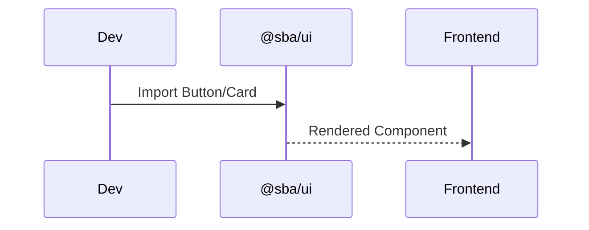
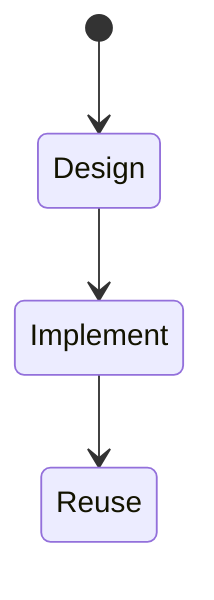

# Paket: @sba/ui (Komponen & Design System)

Versi: 1.0.0
Riwayat Perubahan:

- 1.0.0 (2025-12-05): Dokumen awal use case dan alur.

## Peran & Tanggung Jawab

- Menyediakan komponen UI reusable (atoms/molecules/organisms) untuk `apps/app` dan `apps/web`.
- Konsistensi gaya, tema, dan interaksi; mengurangi duplikasi UI.

## Fitur Utama

- Komponen layout, navigasi, form, tabel, card, modal, toast.
- Theming (dark/light), aksesibilitas, responsif.

## Integrasi

- Dipakai oleh `apps/app` dan `apps/web` melalui transpile di `next.config.js`.
- Bekerja bersama `@sba/utils` untuk helpers gaya.

## Persyaratan Teknis & Dependensi

- React 18, Tailwind CSS (atau util kelas), icon set (mis. lucide-react).

## Tujuan Implementasi

- Reusability tinggi (>70% komponen dipakai lintas-frontend).
- Konsistensi visual dengan variasi minimal.

## Batasan & Lingkup

- Tidak mengandung business logic; hanya presentasi.

## Error Handling

- Validasi props; fallback UI; boundary untuk error rendering.

## Logging & Monitoring

- Minimal; gunakan analitik UI tingkat aplikasi.

## Kontribusi ke SBA

- Mempercepat pengembangan UI konsisten dan dapat dirawat.

## Interaksi dengan Modul Lain

- Dipakai oleh `apps/app`/`apps/web`; tidak bergantung pada API.

## Skalabilitas & Maintainability

- Dokumentasi Storybook (opsional); versi semver.

## Kepatuhan Kualitas & Keamanan

- A11y, linting, snapshot testing komponen.

## Skenario Utama

- Membuat halaman baru dengan komponen siap pakai.

## Skenario Alternatif & Pengecualian

- Kustomisasi tema; override gaya lokal.

## Acceptance Criteria

- Komponen tidak bocor state; props tervalidasi; gaya konsisten.

## Test Plan

- Unit/snapshot komponen; visual regression (opsional).

## Diagram Flowchart

```mermaid
flowchart TD
  Dev --> UI[@sba/ui Components]
  UI --> Apps[apps/app, apps/web]
```

## Use Case (UML teks)

```
Actors: Frontend Dev
Use Cases: Use Shared Components
```

## Sequence



## Activity


