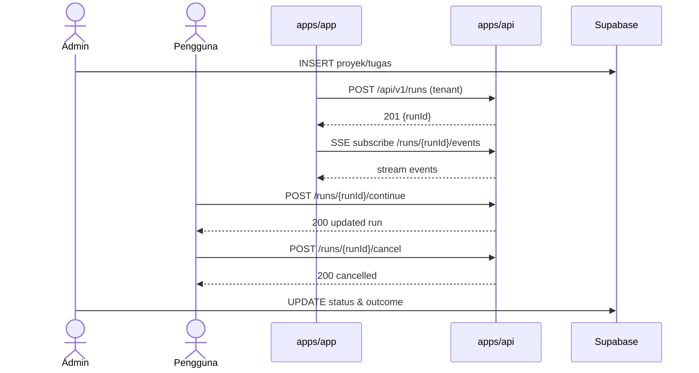
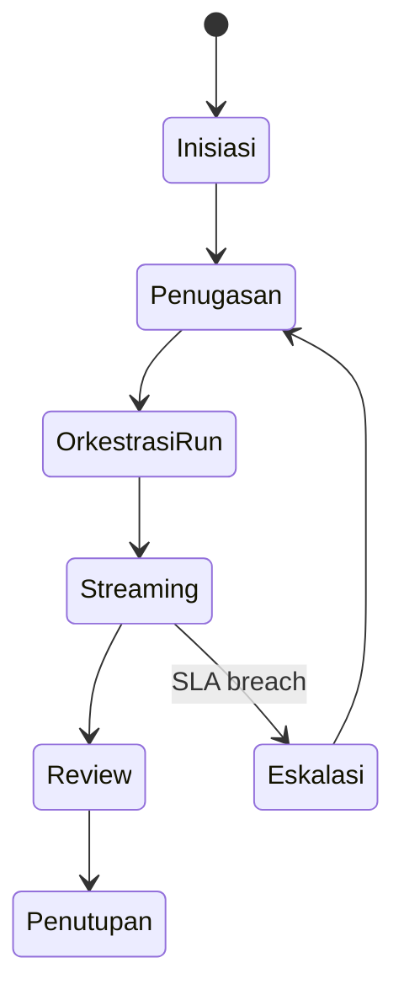

# Use Case: Manajemen Tugas & Proyek

Versi: 1.0.0
Riwayat Perubahan:

- 1.0.0 (2025-12-05): Dokumen pendalaman awal.
  Penanggung Jawab: SBA Docs Team — contact: docs@sba.local

## Deskripsi

Mengelola siklus hidup tugas dan proyek lintas tenant, termasuk inisiasi, penugasan, orkestrasi eksekusi oleh agen, pemantauan progres real-time, review, dan penutupan. Berorientasi pada outcome dan KPI.

Referensi: docs/README.md:68-79

## Aktor

- Admin (inisiasi, penugasan, review, penutupan)
- Pengguna (eksekusi, update status, feedback)
- SistemEksternal (calendar/task tools)
- apps/app (UI orkestrasi runs)
- apps/api (REST/SSE/WS kontrak dan queue)
- Supabase (persistence CRUD)

## Preconditions

- Tenant dan user terotentikasi; peran dan izin ditetapkan
- Proyek/tugas minimal memiliki judul, deskripsi, dan target/KPI
- Integrasi eksternal (kalender/task) dikonfigurasi bila digunakan

## Postconditions

- Tugas/proyek berada pada status selesai/ditunda/dibatalkan
- Outcome terdokumentasi dengan audit trail dan metrik
- Notifikasi dan artefak tersimpan di dokumen terkait

## Alur Utama

1. Admin membuat proyek/tugas (judul, deskripsi, KPI)
2. Penugasan ke pengguna/agen; SLA ditentukan
3. apps/app memulai run agentik via apps/api (`POST /api/v1/runs`)
4. apps/app berlangganan stream via SSE/WS untuk progres
5. Pengguna melakukan update, melanjutkan run, atau membatalkan bila perlu
6. Review outcome, dokumentasi hasil, dan penutupan

## Alur Alternatif & Pengecualian

- SSE gagal → fallback WS → fallback long-poll
- Integrasi kalender gagal → penjadwalan manual, retry terkontrol
- Pelanggaran SLA → eskalasi ke Admin; update prioritas atau reassign
- Akses tenant ditolak → tindakan diblokir, audit dicatat

## Aturan Bisnis

- Isolasi multi-tenant ketat; setiap request membawa `tenantId`
- SLA pengerjaan per tipe tugas; penalti dan eskalasi terdefinisi
- Idempotensi untuk pembuatan/penjadwalan tugas
- Audit trail append-only untuk setiap perubahan status

## Persyaratan Non-Fungsional

- Latensi start run p50 < 500ms
- Streaming event diterima T90% < 2s, reconnect < 10s
- Ketersediaan 99% untuk alur inti; observability lengkap (metrics/traces)
- Keamanan: kontrol akses per peran; tidak menyimpan secrets di klien

## Diagram Use Case

```mermaid
usecaseDiagram
actor Admin
actor User as Pengguna
actor External as SistemEksternal

Admin -- (Inisiasi Proyek/Tugas)
Admin -- (Penugasan & SLA)
Pengguna -- (Eksekusi & Update)
External -- (Sinkronisasi Kalender/Tugas)
(Admin) ..> (Orkestrasi Run Agen) : <<include>>
(Orkestrasi Run Agen) ..> (Streaming Progres) : <<include>>
(Review & Penutupan) ..> (Audit & Dokumentasi) : <<include>>
```

## Diagram Sequence



## Diagram Activity



## Acceptance Criteria

- Tugas/proyek dapat dibuat, ditugaskan, di-track, dan ditutup dengan audit
- Streaming progres berjalan dan fallback berfungsi bila terjadi kegagalan
- SLA dan eskalasi tercatat dan dapat ditindaklanjuti

## Referensi Teknis

- docs/architecture/README.md:45-64
- docs/architecture/RELATIONS.md:3-13
